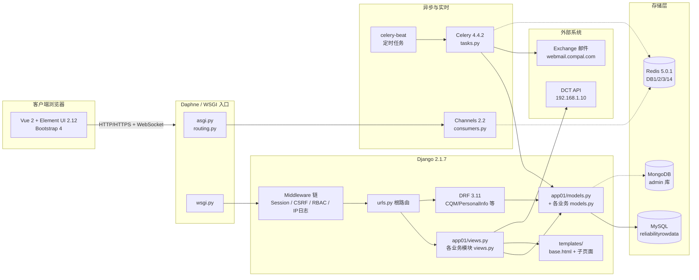

# 01 - 技术架构与目录结构

> 本文档介绍 DDIS 系统的技术栈、整体架构、目录结构与主程式位置。
> 阅读完本文后，可继续阅读 [02-核心运作逻辑.md](./02-核心运作逻辑.md)。

---

## 1.1 技术栈总览

| 类别 | 技术 / 版本 | 说明 |
|------|-------------|------|
| 语言 | Python 3.12.9 | 系统 Python，依赖通过 [requirements.txt](../requirements.txt) 管理 |
| Web 框架 | Django 2.1.7 | MVT 架构，函数视图为主，**不可升级** |
| REST API | Django REST Framework 3.11.0 | ModelSerializer + ViewSet/APIView |
| 认证 | Session + JWT | simplejwt 5.2.0 + djangorestframework-jwt 1.11.0 |
| 任务队列 | Celery 4.4.2 + Redis | 定时任务 (celery-beat) + 异步任务 |
| WebSocket | Django Channels 2.2.0 | 基于 channels-redis 2.4.2 |
| 主数据库 | MySQL (InnoDB / utf-8) | 库名 `reliabilityrowdata`，连接库 PyMySQL 0.9.3 + django-mysql 3.7.0 |
| 辅助数据库 | MongoDB | 库名 `admin`，连接库 mongoengine 0.20.0 + pymongo 3.10.1 |
| 缓存/消息 | Redis 5.0.1 | Celery broker / Channels layer / 业务缓存 |
| 后台管理 | django-simpleui 2022.4.9 | 基于 Django admin 的美化界面 |
| 前端框架 | Vue.js 2.6.10 | **不是 Vue 3，不是 React** |
| UI 组件库 | Element UI 2.12.0 | Vue 2 组件库，**不是 Element Plus** |
| 前端路由 | Vue Router 3.1.3 | 仅用于部分 SPA 页面 |
| HTTP 请求 | Axios（静态 JS 引入） | 非 npm 包，通过 `<script>` 引入 |
| CSS 框架 | Bootstrap 4 + 自定义 CSS | 含 Font Awesome / Themify Icons |
| 模板引擎 | Django Templates | 模板继承 `base.html` |
| 构建工具 | **无** | 前端通过 `<script>` 标签直接引入，无 webpack/vite |
| 部署 | Windows + IIS (wfastcgi 3.0.0) | 开发环境为 Windows |

---

## 1.2 整体架构图



> 说明：
> - HTTP 请求经 WSGI（`wsgi.py`）进入 Django Middleware 链；WebSocket 请求经 ASGI（`asgi.py` / `routing.py`）进入 Channels。
> - 自定义 RBAC 与 IP 日志中间件位于 `middleware/`，对每个 HTTP 请求生效。
> - 异步任务由 `celery-beat` 调度，经 Celery Worker 执行，与外部系统（DCT API、Exchange 邮件）交互。

---

## 1.3 项目目录结构

```
Reliability_Row_data/                    # 项目根目录
├── manage.py                            # Django 入口
├── requirements.txt                     # Python 依赖清单
├── ChannelsServer.bat                   # 启动 Channels (daphne)
├── DDISceleryworker.bat                 # 启动 Celery Worker
├── DDIScelerybeat.bat                   # 启动 Celery Beat
├── OAmail_account.json                  # Exchange 邮件账号配置（敏感）
├── scheduleflag.txt                     # Celery 心跳标志文件
├── Reliability_Row_data/                # 项目主配置包
│   ├── __init__.py                      # pymysql.install_as_MySQLdb() + 导出 celery_app
│   ├── settings.py                       # 全局配置（DB/Redis/Celery/日志/权限/白名单）
│   ├── celery.py                        # Celery 实例定义 + autodiscover_tasks()
│   ├── urls.py                          # 根 URL 路由
│   ├── routing.py                       # Channels ASGI 路由
│   ├── asgi.py                          # ASGI 入口
│   └── wsgi.py                          # WSGI 入口
├── app01/                                # 核心应用（登录/导航/权限/上传/WebSocket/Lesson）
│   ├── views.py                          # 主视图
│   ├── models.py                         # 核心模型（UserInfo/Role/Permission/Menu/lesson_learn 等）
│   ├── serializers.py                    # DRF 序列化器
│   ├── consumers.py                      # WebSocket 消费者
│   ├── routing.py                        # WebSocket 路由
│   ├── tasks.py                           # Celery 异步任务（Ongoing_flag / ProjectSync / 邮件）
│   ├── authentication.py                 # 自定义认证
│   ├── permissions.py                    # 自定义权限
│   ├── forms.py                           # 表单（lessonlearn 等）
│   └── admin.py                           # Admin 注册
├── middleware/                            # 自定义中间件
│   ├── checkper.py                        # RBAC 权限中间件 (RbacMiddleware)
│   ├── UserIP.py                           # 用户访问日志中间件 (LogMiddle)
│   └── __init__.py
├── service/                              # 服务层（非 Django app，纯 Python 模块）
│   └── init_permission.py                # 登录后权限初始化（写入 session）
├── CDM/ CQM/ MQM/ QIL/ TestPlanSW/        # 各业务模块（标准结构）
├── TestPlanME/ TestPlanSWOS/ Bouncing/    # 业务模块
├── DriverTool/ Package/ PersonalInfo/    # 业务模块
├── Issue_Notes/ KnowIssue/ Sustain/       # 业务模块
├── sales/                                # 销售模块
├── mongotest/                            # MongoDB 测试模块
├── extra_apps/                           # 第三方应用（DjangoUeditor 等）
├── templates/                            # Django 模板
│   ├── base.html                         # 基础模板（含主题切换/ElementUI/Vue 引入）
│   ├── base20250911backup.html           # 历史可正常工作的备份版本
│   ├── login.html                        # 登录页
│   ├── Navigations.html                  # 主导航
│   ├── NoPerm.html                       # 无权限提示页
│   ├── Lesson_*.html                     # Lesson Learn 相关页面
│   └── [其它历史备份 .html]
├── static/                               # 静态资源
│   ├── js/                               # vue.js / axios.min.js / vue-router.js / qs.js / jquery 等
│   ├── css/                              # 全局样式
│   ├── download_UPK/                     # Vue 2.6.10 / Element UI 2.12.0 / Vue Router 3.1.3 源码
│   ├── vendor/                           # 第三方 CSS/JS (fontawesome 等)
│   ├── images/ src/ placeholder/         # 图片资源
│   └── package.json                       # 仅静态资源元信息，非 npm 项目
├── logs/                                 # 日志目录（按日期滚动，单文件 5MB，保留 5 份）
├── medias/                               # 媒体文件上传目录（实际 MEDIA_ROOT=c:/media）
└── docs/                                 # ← 本文件夹（技术维护与开发者指引）
```

### 业务模块标准结构

每个业务模块（CDM、CQM、MQM、QIL 等）结构相似：

```
[module]/
├── __init__.py
├── admin.py          # Django Admin 注册
├── apps.py           # App 配置
├── models.py         # 数据模型
├── views.py          # 函数视图
├── urls.py           # 模块 URL 路由
├── forms.py          # Django Form（可选）
├── serializers.py    # DRF 序列化器（仅 DRF 模块）
├── permissions.py    # 自定义权限（可选）
├── authentication.py # 自定义认证（可选）
└── tests.py          # 测试
```

> 说明：CDM 为最小结构，CQM / PersonalInfo 是较完整的 DRF 模块（含 `serializers.py` / `authentication.py` / `permissions.py`）。

---

## 1.4 主程式位置

### 1.4.1 Django 入口

- **WSGI 入口**：[Reliability_Row_data/wsgi.py](../Reliability_Row_data/wsgi.py)
- **ASGI 入口**：[Reliability_Row_data/asgi.py](../Reliability_Row_data/asgi.py)（被 `routing.py` 覆盖 application 对象）
- **管理命令入口**：[manage.py](../manage.py)
- **settings 模块**：`Reliability_Row_data.settings`（由 `manage.py` 与 `celery.py` 通过环境变量 `DJANGO_SETTINGS_MODULE` 指定）

### 1.4.2 根 URL 路由

- **根路由文件**：[Reliability_Row_data/urls.py](../Reliability_Row_data/urls.py)
- **入口模式**：
  - `path('admin/', admin.site.urls)` —— Django Admin
  - `path('docs/', include_docs_urls(title='接口文档'))` —— DRF 接口文档
  - `path('ueditor/', include('DjangoUeditor.urls'))` —— 富文本编辑器
  - 登录/登出/导航等核心视图直接挂载在根级（如 `/login/`, `/index/`, `/Navigations/`, `/Lesson_search/` 等）
  - 各业务模块通过 `path('[module]/', include('[module].urls', namespace='[module]'))` 引入子路由
- **静态文件服务**：DEBUG 模式下，`/static/` 与 `/media/` 由 `django.views.static.serve` 提供。

### 1.4.3 主视图与模型

- **主视图**：[app01/views.py](../app01/views.py)
  - `login` / `logout` / `Change_Password` / `Change_Skin`
  - `index` / `ttt` / `ctest` / `Navigation` / `Navigations` / `Navigations_Category` / `Navigations_system` / `Navigations_customer`
  - `PermInfo_axios` / `ProjectInfoSearch` / `FilesDownload`
  - `Lesson_upload` / `Lesson_edit` / `Lesson_search` / `Lesson_export` / `Lesson_update`
- **主模型**：[app01/models.py](../app01/models.py)
  - `UserInfo`（用户，含 account/password/username/email/role ManyToMany 等）
  - `Role`（角色，绑定 Permission）
  - `Permission`（权限 URL + 所属 Menu）
  - `Menu`（菜单，自引用父子结构）
  - `lesson_learn` / `Imgs` / `Files` / `ProjectinfoinDCT` 等

### 1.4.4 中间件链

定义于 `settings.MIDDLEWARE`，加载顺序严格（自上而下）：

1. `django.middleware.security.SecurityMiddleware`
2. `django.contrib.sessions.middleware.SessionMiddleware`
3. `corsheaders.middleware.CorsMiddleware` —— 跨域（注意顺序在 Common 之前）
4. `django.middleware.common.CommonMiddleware`
5. `django.middleware.csrf.CsrfViewMiddleware`
6. `django.contrib.auth.middleware.AuthenticationMiddleware`
7. `django.contrib.messages.middleware.MessageMiddleware`
8. `django.middleware.clickjacking.XFrameOptionsMiddleware`
9. **`middleware.checkper.RbacMiddleware`** —— 自定义 RBAC 权限
10. **`middleware.UserIP.LogMiddle`** —— 自定义访问日志

### 1.4.5 Celery 实例

- **实例定义**：[Reliability_Row_data/celery.py](../Reliability_Row_data/celery.py)
  - `app = Celery('Reliability_Row_data')`
  - `app.config_from_object('django.conf:settings', namespace='CELERY')` —— 所有以 `CELERY_` 开头的 settings 都被识别
  - `app.autodiscover_tasks()` —— 自动发现各 app 的 `tasks.py`
- **导出**：[Reliability_Row_data/__init__.py](../Reliability_Row_data/__init__.py) 中 `from .celery import app as celery_app`
- **任务定义**：各模块 `tasks.py`，核心任务在 [app01/tasks.py](../app01/tasks.py)

### 1.4.6 Channels 路由

- **项目级路由**：[Reliability_Row_data/routing.py](../Reliability_Row_data/routing.py)
  - 使用 `ProtocolTypeRouter` 分发 `websocket` 协议
  - 套用 `SessionMiddlewareStack`（可在 consumer 中读取 session）
  - 指向 [app01/routing.py](../app01/routing.py)
- **App 级路由**：[app01/routing.py](../app01/routing.py)
  - `url(r'^ws/msg/(?P<room_name>[^/]+)/$', consumers.AsyncConsumer)`
- **消费者**：[app01/consumers.py](../app01/consumers.py)
  - `AsyncConsumer`（异步，实际使用）
  - `SyncConsumer`（同步，仅作示例）
  - `send_group_msg(room_name, message)` —— 供外部调用群发消息

### 1.4.7 配置文件

| 配置 | 位置 | 关键项 |
|------|------|--------|
| 全局配置 | [settings.py](../Reliability_Row_data/settings.py) | DB/Redis/Celery/日志/Session/权限白名单 `SAFE_URL` |
| Celery 配置 | settings.py 底部 `CELERY_*` 段 | `CELERY_BROKER_URL` / `CELERY_RESULT_BACKEND` / `CELERY_BEAT_SCHEDULE` |
| Channels 配置 | settings.py 中 `CHANNEL_LAYERS` | `channels_redis`，DB=14 |
| Session 配置 | settings.py 中 `SESSION_*` 段 | DB 存储，过期 5 天，每次请求刷新 |
| 邮件配置 | settings.py 顶部 `EMAIL_*` 与 `OAmail_account.json` | QQ 邮件 SMTP / Exchange 账号 |
| 文件上传 | settings.py 中 `FILE_UPLOAD_*` / `MEDIA_ROOT` | `c:/media`，最大 1GB |

---

## 1.5 已注册业务模块清单

下表为 `settings.INSTALLED_APPS` 中实际注册的业务模块（除 Django/DRF/Celery/Channels 框架外）：

| 模块 | URL 前缀 | Namespace | 用途简述 |
|------|----------|-----------|----------|
| app01 | `/` 根级 | — | 登录/导航/权限/上传/WebSocket/Lesson |
| CDM | `/CDM/` | `CDM` | Customer Data Management |
| CQM | `/CQM/` | `CQM` | 含 DRF API + JWT 认证 |
| MQM | `/MQM/` | `MQM` | — |
| QIL | `/QIL/` | `QIL` | — |
| Bouncing | `/Bouncing/` | `Bouncing` | — |
| Package | `/Package/` | `Package` | — |
| TestPlanME | `/TestPlanME/` | `TestPlanME` | ME 测试计划 |
| LessonProjectME | `/LessonProjectME/`、`/Lesson/` | `LessonProjectME`、`article` | ME Lesson |
| DriverTool | `/DriverTool/` | `DriverTool` | — |
| TestPlanSW | `/TestPlanSW/` | `TestPlanSW` | SW 测试计划（含 API） |
| TestPlanSWOS | `/TestPlanSWOS/` | `TestPlanSWOS` | SW OS 测试计划（含 API） |
| AutoResult | `/AutoResult/` | `AutoResult` | — |
| OBIDeviceResult | `/OBIDeviceResult/` | `OBIDeviceResult` | — |
| ABOTestPlan | `/ABOTestPlan/` | `ABOTestPlan` | ABO 测试计划 |
| PersonalInfo | `/PersonalInfo/` | `PersonnalInfo` | 人员信息（含 DRF API + JWT） |
| PersonalExperience | `/PersonalExperience/` | `PersonalExperience` | — |
| NonDQALesson | `/NonDQALesson/` | `NonDQALesson` | — |
| LowLightList | `/LowLightList/` | `LowLightList` | — |
| IssuesBreakdown | `/IssuesBreakdown/` | `IssuesBreakdown` | — |
| ABOProjectLessonL | `/ABOProjectLessonL/` | `ABOProjectLessonL` | — |
| ABOQIL | `/ABOQIL/` | `ABOQIL` | — |
| ProjectComparison | `/ProjectComparison/` | `ProjectComparison` | — |
| ABODriverTool | `/ABODriverTool/` | `ABODriverTool` | — |
| CapitalExpenditure | `/CapitalExpenditure/` | `CapitalExpenditure` | — |
| A31LessonLProject | `/A31LessonLProject/` | `A31LessonLProject` | — |
| A32LessonLProject | `/A32LessonLProject/` | `A32LessonLProject` | — |
| CriticalIssueCrossCheck | `/CriticalIssueCrossCheck/` | `CriticalIssueCrossCheck` | 关键 Issue 交叉检查 |
| MiscellaneousPurchases | `/MiscellaneousPurchases/` | `MiscellaneousPurchases` | — |
| CommonDevice | `/CommonDevice/` | `CommonDevice` | — |
| CommonFiles | `/CommonFiles/` | `CommonFiles` | — |
| UElist | `/UElist/` | `UElist` | — |
| PCRList | `/PCRList/` | `PCRList` | — |
| Sustain | `/Sustain/` | `Sustain` | — |
| sales | `/sales/` | `sales` | 销售模块 |
| mongotest | `/mongotest/` | `mongotest` | MongoDB 测试 |
| INVGantt | `/INVGantt/` | `INVGantt` | 甘特图（含外部 API） |
| SpecDownload | `/SpecDownload/` | `SpecDownload` | 规格下载 |
| Issue_Notes | `/Issue_Notes/` | `Issue_Notes` | — |
| KnowIssue | `/KnowIssue/` | `KnowIssue` | — |

> 详细接口测试命令见 [03-部署启动与运行维护.md](./03-部署启动与运行维护.md)。
