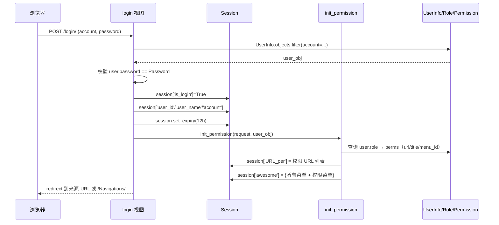

# 02 - 核心运作逻辑

> 本文档说明 DDIS 系统的认证与权限、Celery 任务、WebSocket、中间件、日志、Redis 用途等核心运行机制。
> 主程式位置见 [01-技术架构与目录结构.md](./01-技术架构与目录结构.md)。

---

## 2.1 认证与权限模型（RBAC）

### 2.1.1 用户-角色-权限-菜单 模型

定义在 [app01/models.py](../app01/models.py)：

```
UserInfo (用户)
   └── role (ManyToMany) ──→ Role (角色)
                                └── perms (ManyToMany) ──→ Permission (权限)
                                                            └── menu (ForeignKey) ──→ Menu (菜单，自引用父子)
```

- `UserInfo.account`：登录账号，唯一。
- `UserInfo.password`：**明文存储**（旧设计，未使用 Django auth hash）。新开发时不应沿用此模式。
- `Permission.url`：权限对应的 URL，例如 `/CDM/CDM_search/`。
- `Permission.Menu_title`：菜单项标题。
- `Menu`：自引用外键 `parent`，构成层级菜单。

### 2.1.2 登录流程

入口：`POST /login/` → [app01/views.py](../app01/views.py) 中 `login` 视图。



关键点：
- 登录后 `request.session['is_login'] = True`，所有视图函数通过 `request.session.get('is_login', None)` 判断登录状态。
- 权限 URL 列表写入 `session[settings.SESSION_PERMISSION_URL_KEY]`，键名 `URL_per`。
- 菜单与权限菜单写入 `session[settings.SESSION_MENU_KEY]`，键名 `awesome`。
- Session 过期时间：`SESSION_COOKIE_AGE = 5 * 24 * 60 * 60`（5 天）；`SESSION_SAVE_EVERY_REQUEST = True`（每次请求刷新过期）。
- Session 存储：`SESSION_ENGINE = 'django.contrib.sessions.backends.db'`；`SESSION_SERIALIZER = PickleSerializer`。

### 2.1.3 RBAC 权限中间件

[middleware/checkper.py](../middleware/checkper.py) 中 `RbacMiddleware.process_request`：

1. 取 `request.path_info` 作为当前请求 URL。
2. **白名单匹配**：遍历 `settings.SAFE_URL`，若 `re.match(url, request_url)` 命中则放行，并对非登录/登出/首页/admin 的"页面型"URL 设置 `current_page_DDIS` cookie。
3. **未登录重定向**：若 session 中无 `permission_url`，重定向到 `settings.LOGIN_URL`（`/login/`）。
4. **权限正则匹配**：遍历用户权限 URL 列表，用 `settings.REGEX_URL = r'{url}'` 做严格正则匹配。命中则放行并刷新 cookie。
5. **无权限提示**：未命中时，DEBUG 模式显示可访问 URL 列表；非 DEBUG 模式渲染 `NoPerm.html`。

> **重要**：`RbacMiddleware` 使用了自定义的 `MiddlewareMixin`（与 `django.utils.deprecation.MiddlewareMixin` 同名但定义在 `checkper.py` 中）。修改此文件时不要破坏 process_request/process_response 调用顺序。

### 2.1.4 权限白名单（SAFE_URL）

定义在 [settings.py](../Reliability_Row_data/settings.py) 的 `SAFE_URL` 列表（正则字符串）。例如：
- `/login/`, `/admin/.*`, `/logout/`, `/index/`, `/Navigations/`
- `/media/.*`, `/static/.*`
- `/CQM/CQMapi/.*`, `/PersonalInfo/api_Per/.*` 等 DRF API
- `/TestPlanSW/api/token/.*`（JWT 获取/刷新）
- `/docs/.*`（接口文档）

> **新增需跳过权限的 URL**：在 `SAFE_URL` 中追加正则字符串即可，注意 `re.match` 是从开头匹配。

### 2.1.5 JWT 认证

- 包：`djangorestframework-simplejwt 5.2.0` + `djangorestframework-jwt 1.11.0`（兼容）
- 配置：`settings.SIMPLE_JWT`
  - `ACCESS_TOKEN_LIFETIME = 30 分钟`
  - `REFRESH_TOKEN_LIFETIME = 20 分钟`
- 使用场景：CQM、PersonalInfo、TestPlanSW、TestPlanSWOS 等 DRF API 模块。
- 路由：`/api/token/`、`/api/refresh/`、`/api/verify/`（注释状态，需手动启用），或各模块自定义 `/CQM/api/...`、`/TestPlanSW/api/token/...`。

---

## 2.2 中间件机制

### 2.2.1 中间件链（settings.MIDDLEWARE）

加载顺序严格（自上而下）：

1. SecurityMiddleware
2. SessionMiddleware
3. CorsMiddleware（跨域，必须在 Common 之前）
4. CommonMiddleware
5. CsrfViewMiddleware
6. AuthenticationMiddleware
7. MessageMiddleware
8. XFrameOptionsMiddleware
9. **RbacMiddleware**（自定义 RBAC）
10. **LogMiddle**（自定义访问日志）

### 2.2.2 访问日志中间件

[middleware/UserIP.py](../middleware/UserIP.py) 中 `LogMiddle`：

- `process_request`：记录 `request.init_time`。
- `process_response`：对 GET/POST 请求，构造日志消息并写入 `logger = logging.getLogger('log')`。
- 日志内容：`时间: Account/request.user/username > CLIENTNAME/COMPUTERNAME/USERNAME > ip/proxy_ip > request`
- IP 获取：优先 `HTTP_X_FORWARDED_FOR`，其次 `REMOTE_ADDR`。
- 异常处理：日志记录本身出错会写 `logger.critical('系统错误: %s' % e)`，不影响响应。

> **注意**：修改此中间件时不要抛出异常到响应流，避免导致前端 500。

---

## 2.3 Celery 任务体系

### 2.3.1 Celery 实例与配置

- 实例：[Reliability_Row_data/celery.py](../Reliability_Row_data/celery.py)
  - `app = Celery('Reliability_Row_data')`
  - `app.config_from_object('django.conf:settings', namespace='CELERY')`
  - `app.autodiscover_tasks()` —— 自动发现所有 app 的 `tasks.py`
- 导出：`Reliability_Row_data/__init__.py` 中 `from .celery import app as celery_app`

### 2.3.2 Broker / Result Backend

| 配置 | 值 | 说明 |
|------|----|------|
| `CELERY_BROKER_URL` | `redis://:DCT2019@localhost:6379/1` | 消息队列 |
| `CELERY_RESULT_BACKEND` | `redis://:DCT2019@localhost:6379/2` | 结果存储 |
| `CELERY_RESULT_SERIALIZER` | `json` | — |
| `CELERY_TIMEZONE` | `Asia/Shanghai` | 必须与 `TIME_ZONE` 一致 |

### 2.3.3 定时任务（CELERY_BEAT_SCHEDULE）

定义在 [settings.py](../Reliability_Row_data/settings.py)：

| 任务名 | Task | Schedule | 说明 |
|--------|------|----------|------|
| `task-flag` | `app01.tasks.Ongoing_flag` | 每 60 秒 | 向 `scheduleflag.txt` 写入当前时间，作为系统存活心跳 |
| `task-one` | `app01.tasks.ProjectSync` | 每周一至五 08:30 | 从 DCT API 同步项目信息到 `ProjectinfoinDCT` 表 |

### 2.3.4 核心任务清单

位于 [app01/tasks.py](../app01/tasks.py)：

| 任务 | 功能 |
|------|------|
| `Ongoing_flag` | 心跳：写 `scheduleflag.txt` |
| `ProjectSync` | 调用 `ImportProjectinfoFromDCT()`：请求 `http://192.168.1.10/dct/api/ClientSvc/getAllProjectInfo`（NTLM 鉴权）→ 增量更新 `ProjectinfoinDCT` |
| `MailhtmlSync` / `Mailhtml` | 扫描超期机种（TestPlanSW/CQM/DriverList/ToolList），通过 QQ SMTP 发送 HTML 邮件提醒 |
| `MailOAtest(**kwargs)` | 通过 Exchange (exchangelib) 发送 CriticalIssue Cross Check 提醒邮件；一天分 4 个时点（10:00、15:00、第三次、截至）调度发送 |
| `OASMTPMail` | 通过 aiosmtplib 异步发送 SMTP 邮件（内网 `10.128.2.181:25`，发件人 `DDIS_Admin@Compal.com`） |
| `Mailsend(**kwargs)` | （非 task）Exchange 邮件实际发送函数，读取 `OAmail_account.json` 中的账号密码 |

> **外部调用**：业务视图可通过 `from app01.tasks import MailOAtest` 然后 `MailOAtest.delay(**kwargs)` 异步触发邮件。

### 2.3.5 心跳监控

- `scheduleflag.txt` 每分钟由 `Ongoing_flag` 任务写入当前时间。
- 维护时可通过检查该文件的修改时间判断 Celery Worker 是否正常运行（详见 [03-部署启动与运行维护.md](./03-部署启动与运行维护.md)）。

---

## 2.4 WebSocket（Channels）

### 2.4.1 路由

- 项目级：[Reliability_Row_data/routing.py](../Reliability_Row_data/routing.py)
  - `ProtocolTypeRouter`：将 `websocket` 协议交给 `SessionMiddlewareStack(URLRouter(app01.routing.websocket_urlpatterns))`
- App 级：[app01/routing.py](../app01/routing.py)
  - `^ws/msg/(?P<room_name>[^/]+)/$` → `consumers.AsyncConsumer`

### 2.4.2 消费者

[app01/consumers.py](../app01/consumers.py)：

- `AsyncConsumer`（异步，实际使用）：
  - `connect()`：从 URL 取 `room_name`，构造 `notice_{room_name}` 群组并加入，`accept()` 接受连接。
  - `disconnect(close_code)`：从群组移除。
  - `receive(text_data)`：解析 JSON 取 `message`，向群组广播 `system_message` 事件。
  - `system_message(event)`：从群组接收消息，回传给 WebSocket 单连接。
- `SyncConsumer`（同步，仅作示例，未启用）。
- `send_group_msg(room_name, message)`：**供外部调用**的辅助函数，使用 `get_channel_layer().group_send()` 群发。

### 2.4.3 Channels 后端

```python
CHANNEL_LAYERS = {
    "default": {
        "BACKEND": "channels_redis.core.RedisChannelLayer",
        "CONFIG": {
            "hosts": ["redis://:DCT2019@localhost:6379/14"],
        },
    },
}
```

- 使用 Redis DB=14 作为 Channels 层，与 Celery / 业务缓存分离。

---

## 2.5 Redis 多 DB 用途分配

| DB | 用途 | 配置项 |
|----|------|--------|
| 1 | Celery Broker | `CELERY_BROKER_URL` |
| 2 | Celery Result Backend | `CELERY_RESULT_BACKEND` |
| 3 | 业务缓存（分布式锁 / 幂等 / 库存预扣） | `settings.REDIS_DB_BUSINESS`（业务代码按需使用） |
| 14 | Channels Layer | `CHANNEL_LAYERS.default.CONFIG.hosts` |

> Redis 密码：`DCT2019`（与 settings.py 中明文存在）。
> **重要**：同一台机器启动多个 Celery 时，BROKER_URL 必须使用不同的 Redis DB，否则会串任务。

---

## 2.6 日志体系

### 2.6.1 配置

定义在 [settings.py](../Reliability_Row_data/settings.py) 的 `LOGGING`：

| Handler | 文件 | 级别 | 说明 |
|---------|------|------|------|
| `default` | `logs/all-{YYYY-MM-DD}.log` | DEBUG | 全量日志，单文件 5MB，保留 5 份 |
| `error` | `logs/error-{YYYY-MM-DD}.log` | ERROR | 错误日志 |
| `info` | `logs/info-{YYYY-MM-DD}.log` | INFO | info 级别 |
| `console` | 控制台 | DEBUG | 标准格式 |

格式：`[%(asctime)s] [%(filename)s:%(lineno)d] [%(module)s:%(funcName)s] [%(levelname)s]- %(message)s`

### 2.6.2 Logger

| Logger | Handlers | 级别 | 说明 |
|--------|----------|------|------|
| `django` | default / console / error | INFO | Django 框架日志 |
| `log` | error / info / console / default | INFO | 业务日志（在 `middleware/UserIP.py` 中通过 `getLogger('log')` 使用） |

另有 `celerybeat.pid` 与 `logs/ProjectSync-{YYYYMMDD}.txt`（由 `ProjectSync` 任务写入同步结果）。

---

## 2.7 数据库

### 2.7.1 MySQL（主库）

- 库名：`reliabilityrowdata`
- 引擎：InnoDB，字符集 utf-8
- 连接：`127.0.0.1:3306`，账号 `edwin / DCT@2019`
- 驱动：PyMySQL 0.9.3（在 `__init__.py` 中 `pymysql.install_as_MYSQLdb()`），django-mysql 3.7.0
- 查询方式：Django ORM 为主，少量原生 SQL。

### 2.7.2 MongoDB（辅助）

- 连接：`127.0.0.1:27017`，账号 `edwin / DCT@2019`，库 `admin`
- 驱动：mongoengine 0.20.0 + pymongo 3.10.1
- 初始化：在 `settings.py` 顶部 `mongoengine.connect(_MONGODB_NAME, host=_MONGODB_DATABASE_HOST)`
- 使用模块：`mongotest`（演示用），其余业务模块基本不用。

### 2.7.3 业务模型字段命名约定

- 模型类名：PascalCase（如 `CDM`、`CQM`、`PersonalInfo`）。
- 字段名：PascalCase 或混合命名（如 `Customer`、`Project`、`SKU_NO`、`edit_time`）。**与现有代码保持一致**。
- 每个模型类定义 `Meta.verbose_name` / `verbose_name_plural`。
- 每个模型类定义 `toJSON(self)` 方法，用于序列化（旧约定，DRF 模块用 ModelSerializer 替代）。

---

## 2.8 前端运行机制

### 2.8.1 无构建工具的前端栈

- Vue 2.6.10 源码：`static/download_UPK/vue@2.6.10/dist/vue.js`
- Element UI 2.12.0：`static/download_UPK/element-ui@2.12.0/lib/index.js` + `theme-chalk/index.css`
- Vue Router 3.1.3：`static/download_UPK/` 或 `static/js/vue-router.js`
- Axios：`static/js/axios.min.js`
- 全部通过 `<script>` / `<link>` 在 Django 模板中直接引入。

### 2.8.2 模板继承

- 所有页面继承 [templates/base.html](../templates/base.html)：``
- 模板区块：
  - `` 页面标题
  - `` / `` 页面样式
  - `` 页面内容
- `base.html` 提供主题切换、导航、ElementUI / Vue 全局引入。
- **修改 `base.html` 必须使用 scoped class，不能影响子页面样式**（参考 `base20250911backup.html` 是已知可正常工作的版本）。

### 2.8.3 Vue 实例模式

```javascript
new Vue({
    el: '#app',
    data() { return { tableData: [], form: {}, loading: false } },
    methods: {
        fetchData() {
            axios.post('/CDM/CDM_search/', { /* ... */ })
                .then(res => { this.tableData = res.data })
        }
    },
    mounted() { this.fetchData() }
})
```

- POST 请求需携带 CSRF Token（通过 `Qs.stringify` 或 FormData）。
- 请求 URL 使用相对路径。
- 响应数据格式：直接返回 JSON。

### 2.8.4 主题切换

- `body` 上动态添加 `theme-light` / `theme-dark` class。
- **禁止硬编码颜色**，使用 CSS 变量或依赖主题 class。
- 子页面背景使用 `rgba()` 半透明，不要固定背景。

---

## 2.9 关键外部依赖

| 外部 | 用途 | 鉴权 |
|------|------|------|
| DCT API `http://192.168.1.10/dct/api/ClientSvc/getAllProjectInfo` | 同步项目信息（`ImportProjectinfoFromDCT`） | NTLM（`DCT\administrator` / `DQA3\`2018`，注意密码含反引号） |
| Exchange `webmail.compal.com` | OA 邮件发送（`MailOAtest` / `Mailsend`） | NTLM，账号读自 `OAmail_account.json` |
| QQ SMTP `smtp.qq.com:25` | 外网邮件发送（`Mailhtml` 系列） | 用户名 + 授权码 |
| 内网 SMTP `10.128.2.181:25` | OA SMTP 异步邮件（`OASMTPMail`） | 无鉴权 |

> **敏感信息**：上述账号密码均明文存在于 [settings.py](../Reliability_Row_data/settings.py) / [OAmail_account.json](../OAmail_account.json) / [app01/tasks.py](../app01/tasks.py)。AI 辅助开发时**不要暴露到前端**，文档化时也避免在公开文档中重复敏感值。
